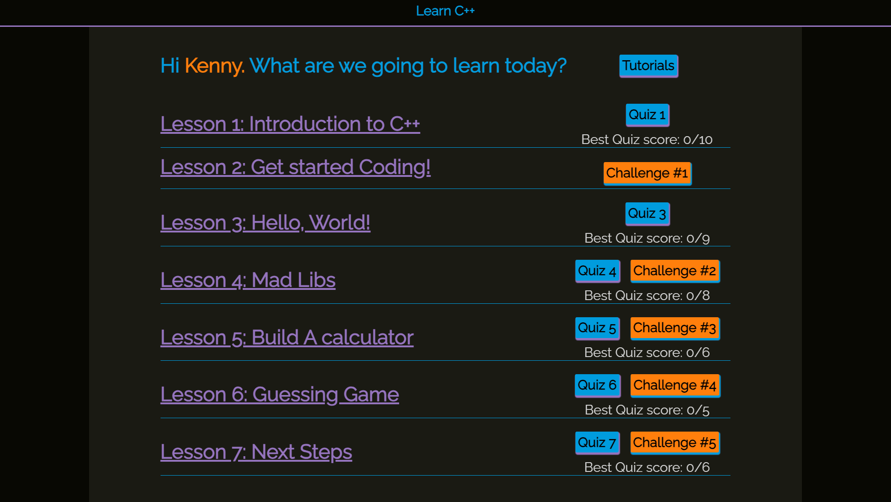
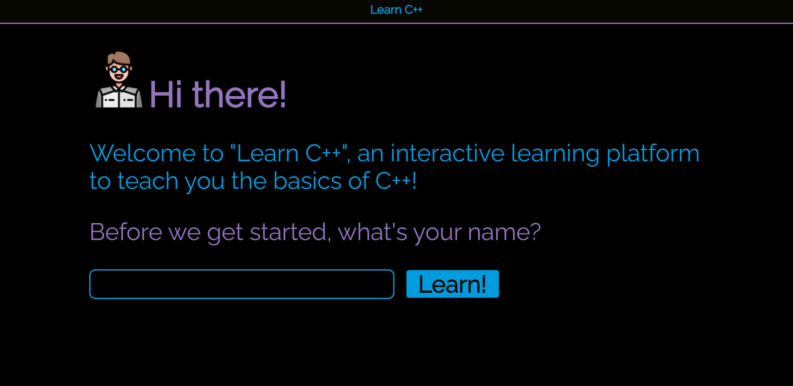
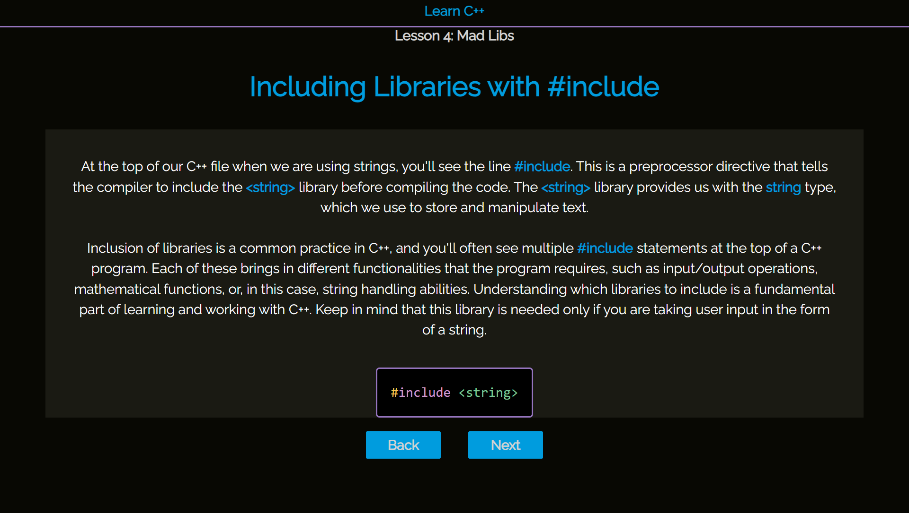
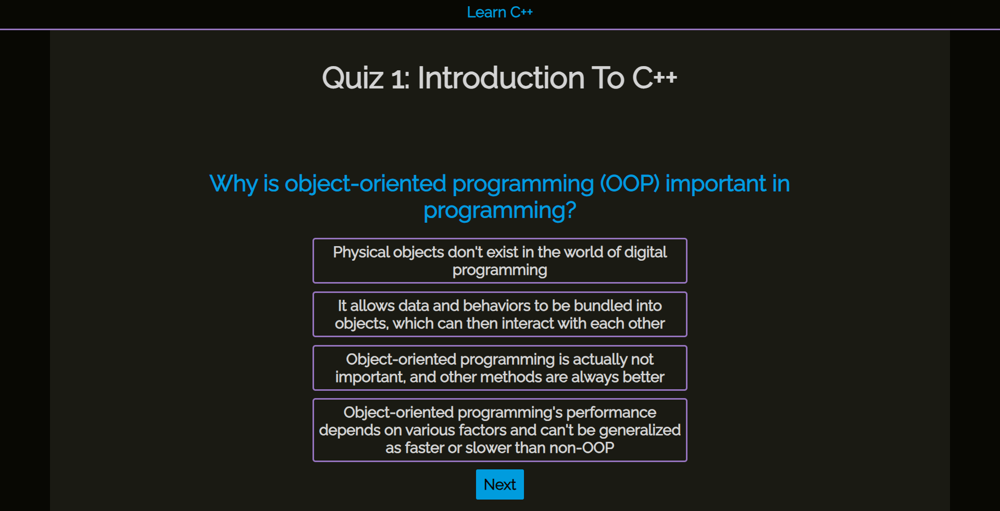
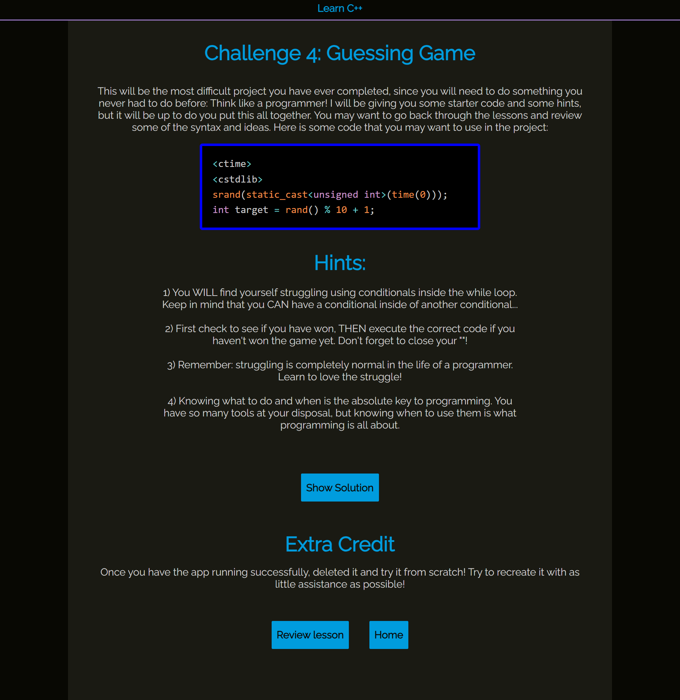

# **Learn C++**

## **Table of Contents**
- [License](#license)
- [Project Overview](#project-overview)
- [Landing Page](#landing-page)
- [Lesson Example](#lesson-example)
- [Quiz Example](#quiz-example)
- [Challenge Example](#challenge-example)
- [Purpose and Inspiration](#purpose-and-inspiration)
- [Unique Technologies](#unique-technologies)
- [Technologies Used](#technologies-used)
- [Deployment](#Deployment)
- [Testing](#testing)

## **License**
This project is licensed under the MIT license.

## **Project Overview**
"Learn C++" is an innovative, hands-on learning platform that focuses on practicality, starting with real-world projects and dissecting them to teach users the fundamentals of C++. The platform engages users through a combination of interactive lessons, quizzes, and challenges, effectively fostering a deep understanding of C++ basics. 

## **Landing Page**

## **Lesson Example**

Each lesson starts with displaying the code for the unit challenge. Although this will look foreign, each line of code is explained through out the lesson. Each lesson contains 10 slides, and gives additional information about each line of code.

## **Quiz Example**

At the end of each lesson, a multiple choice / true-false quiz is given to test the users understanding of the project. Each lesson slide contains a quiz question, and the highest score is saved on the homepage. 

## **Challenge Example**

Once the quiz is completed, the user can now try building the challenge that was presented to them at the beginning of the lesson. With the exception of the final challenge, they all contain started code that progressively becomes less and less as the challenges progress, until they must build the final lessons challenge from scratch.

## **Purpose and Inspiration**
Jay Padrnos approached me with a unique request - he was keen on learning C++, but not in the conventional way. Jay wanted to try a more hands-on approach that allowed him to engage with the language directly. He proposed an interesting challenge for me: to create a learning platform that starts with projects and then deconstructs them, contrary to the traditional method of learning code first and then applying it. Embracing this fresh perspective, I embarked on designing a platform tailored to Jay's learning style, all the while fostering his curiosity and passion for C++.

## **Unique Technologies**
**TypeScript:**
TypeScript is a statically-typed superset of JavaScript, developed by Microsoft to catch common errors early in the development process. It allows developers to specify types for variables and function parameters, providing better tooling and documentation. Once TypeScript code is written, it's compiled into JavaScript, enabling it to run in any JavaScript environment.

## **Technologies Used**
* React.js
* TypeScript (JavaScript)
* CSS
* HTML
* Styled-components

## **Deployment**
Respecting my client's confidentiality, I am not authorized to publicly share the project link. To explore the functionality and design of this project, please do not hesitate to reach out to me at geckob4i@gmail.com. We can arrange a virtual meeting where I will be pleased to provide a comprehensive walkthrough of the project. Your understanding and cooperation are greatly appreciated.

## **Testing**
Here is the coverage table for the projects tests:

File                               | % Stmts | % Branch | % Funcs | % Lines | Uncovered Line #s    
-----------------------------------|---------|----------|---------|---------|----------------------
All files                          |   90.62 |    68.75 |   78.72 |   91.59 |                      
 src                               |     100 |      100 |   66.66 |     100 |                      
  App.tsx                          |     100 |      100 |   66.66 |     100 |                      
 src/components                    |   78.16 |    53.33 |   62.06 |   79.06 |                      
  Header.tsx                       |   85.71 |      100 |       0 |   85.71 | 4                    
  HomePage.tsx                     |      82 |    66.66 |   77.77 |   83.67 | 22-23,28-31,35-37,83 
  ScoresTemplate.tsx               |      64 |    44.44 |      25 |      64 | 34,39-48,59-63       
  ScrollToTop.tsx                  |     100 |      100 |     100 |     100 |                      
 src/components/Challenges         |   98.79 |      100 |     100 |   98.78 |                      
  Challenge2.tsx                   |     100 |      100 |     100 |     100 |                      
  Challenge4.tsx                   |     100 |      100 |     100 |     100 |                      
  Challenge5.tsx                   |     100 |      100 |     100 |     100 | 
  Challenge6.tsx                   |     100 |      100 |     100 |     100 | 
  Challenge7.tsx                   |     100 |      100 |     100 |     100 | 
  ChallengeLoader.tsx              |    92.3 |      100 |     100 |   91.66 | 17
 src/components/Lessons            |   96.49 |    85.71 |   86.66 |   96.36 | 
  LessonTemplate.tsx               |     100 |      100 |     100 |     100 | 
  Lessons.tsx                      |   93.93 |       90 |   81.81 |   93.54 | 81-87
  LessonsSlider.tsx                |     100 |       75 |     100 |     100 | 48
  index.ts                         |       0 |        0 |       0 |       0 | 
 src/components/Lessons/LessonData |     100 |      100 |     100 |     100 | 
  Lesson1Data.ts                   |     100 |      100 |     100 |     100 | 
  Lesson2Data.ts                   |     100 |      100 |     100 |     100 | 
  Lesson3Data.ts                   |     100 |      100 |     100 |     100 | 
  Lesson4Data.ts                   |     100 |      100 |     100 |     100 | 
  Lesson5Data.ts                   |     100 |      100 |     100 |     100 | 
  Lesson6Data.ts                   |     100 |      100 |     100 |     100 | 
  Lesson7Data.ts                   |     100 |      100 |     100 |     100 | 
 src/components/Quizzes            |   82.53 |     42.1 |    64.7 |   86.66 | 
  QuizSlider.tsx                   |   88.46 |     62.5 |      75 |   95.83 | 19
  QuizTemplate.tsx                 |     100 |      100 |     100 |     100 | 
  Quizzes.tsx                      |   76.47 |    27.27 |      50 |   78.78 | 34-39,45-54,84      
 src/components/Quizzes/QuizData   |     100 |      100 |     100 |     100 | 
  Quiz1Data.ts                     |     100 |      100 |     100 |     100 | 
  Quiz3Data.ts                     |     100 |      100 |     100 |     100 | 
  Quiz4Data.ts                     |     100 |      100 |     100 |     100 | 
  Quiz5Data.ts                     |     100 |      100 |     100 |     100 | 
  Quiz6Data.ts                     |     100 |      100 |     100 |     100 |                      
  Quiz7Data.ts                     |     100 |      100 |     100 |     100 | 
 src/components/Tutorials          |     100 |      100 |     100 |     100 | 
  ChallengeTutorial.tsx            |     100 |      100 |     100 |     100 | 
  LessonTutorial.tsx               |     100 |      100 |     100 |     100 | 
  QuizTutorial.tsx                 |     100 |      100 |     100 |     100 | 
  SiteTutorial.tsx                 |     100 |      100 |     100 |     100 | 